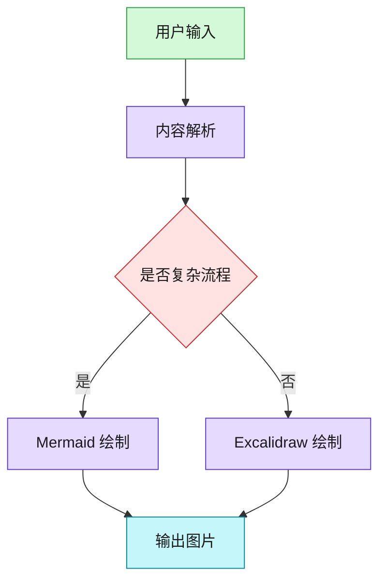

# 引擎选择细则

## 目录

- 基本优先级
- 快速判定表
- Mermaid 语义色板
- Mermaid 布局约束
- 引擎强制参数处理

## 基本优先级

默认优先级：`Gemini > Excalidraw > Mermaid`。

先判断“视觉表达需求”，再判断“结构复杂度”：

- 需要情绪、隐喻、视觉冲击：优先 Gemini。
- 需要概念关系、对比、轻流程：优先 Excalidraw。
- 需要严格结构化、节点较多、多分支：才使用 Mermaid。

## 快速判定表

| 场景 | 推荐引擎 | 说明 |
|---|---|---|
| 封面图、缩略图、品牌视觉 | Gemini | 需要高视觉表现力 |
| 方法论对比图、概念拆解图 | Excalidraw | 手绘风格更友好 |
| 简单流程图（<= 8 节点） | Excalidraw | 可读性优于 Mermaid |
| 复杂流程图（> 8 节点） | Mermaid | 结构维护成本更低 |
| 多层架构图 | Mermaid | 分组和层级清晰 |
| 多角色时序图 | Mermaid | 时序语义更自然 |
| 无法图表化的抽象概念 | Gemini | 让模型做视觉转译 |

## Mermaid 语义色板

Mermaid 必须使用 `classDef` + `class` 应用颜色，不要只写默认节点。

| 语义 | 填充色 | 边框色 | 用途 |
|---|---|---|---|
| input | `#d3f9d8` | `#2f9e44` | 输入、起点、数据源 |
| process | `#e5dbff` | `#5f3dc4` | 处理、推理、核心逻辑 |
| decision | `#ffe3e3` | `#c92a2a` | 决策点、分支判断 |
| action | `#ffe8cc` | `#d9480f` | 执行动作、工具调用 |
| output | `#c5f6fa` | `#0c8599` | 输出、结果、终点 |
| storage | `#fff4e6` | `#e67700` | 存储、数据库、缓存 |
| meta | `#e7f5ff` | `#1971c2` | 标题、分组、元信息 |

示例：

## Mermaid 布局约束

- 方向：默认 `TB`，明显横向流程使用 `LR`。
- 箭头：`-->` 主路径，`-.->` 辅助路径，`==>` 强调路径。
- 分组：相关节点使用 `subgraph`，标题简洁。
- 文案：单节点文本建议不超过 8 个汉字，不使用 emoji。
- 规模：单图建议不超过 15 节点，超过则拆图。

## 引擎强制参数处理

当用户显式指定 `--engine` 时，按用户指定执行：

- `--engine gemini`：不做图表引擎回退。
- `--engine excalidraw`：不回退 Mermaid。
- `--engine mermaid`：仅输出 Mermaid 结果或嵌入代码块（`--mermaid-embed`）。
- `--engine auto`：按本文件的优先级和判定表选择。
